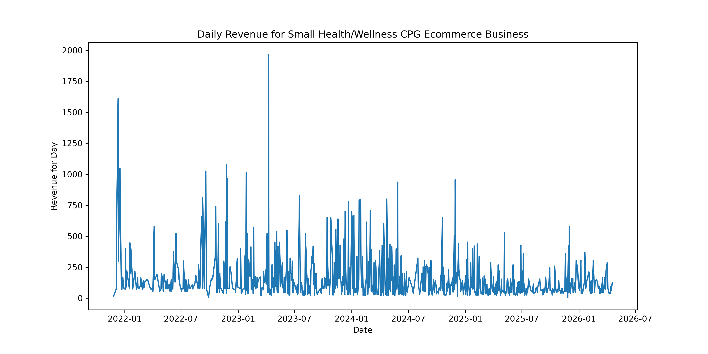
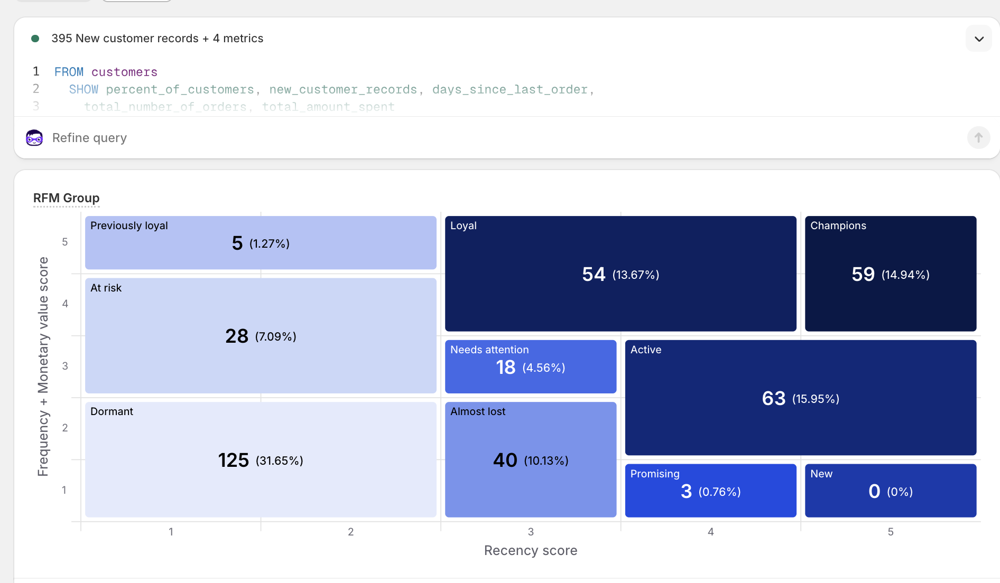
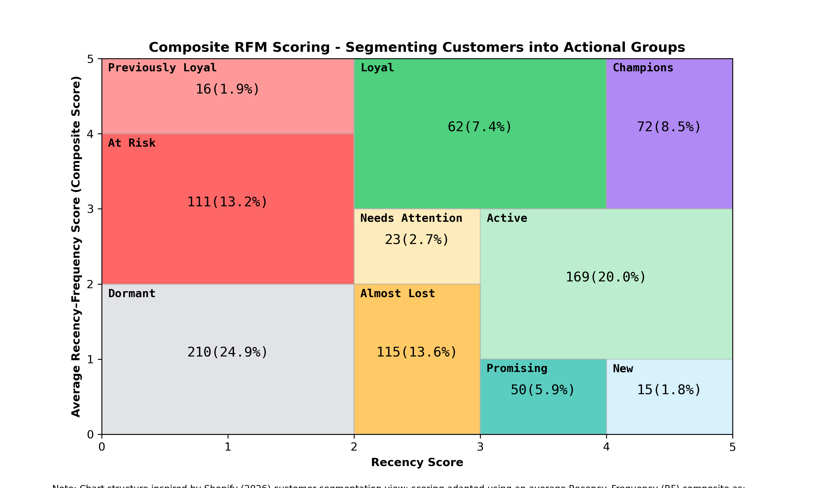

# RFM Analysis

This data was collected between November, 2021 and April, 2026 for a Health and Wellness Ecommerce small business. Although the total revenue for the business is relatively small, there is a large repurchase rate over the course of years, so the data is worth evaluating. These analyses may support making recommendations for how the business can approach future endevours.

All data analysis and visualization was conducted using the Python language (Python Software Foundation [2025]; henceforth “Python”), leveraging a Jupyter Notebook to scaffold and break down the different components of the analysis. This demonstrates the group’s competency in the learned skills from the course. [The Jupyter Notebook can be accessed and visualized here.](ecommerce_data.ipynb)

### Summary of Data
[The original dataset](unidentified_ecom_data.csv) was exported from the ecommerce platforms and de-identified by assigning a unique customer ID per customer. In an actual company analysis, features such as name and email address would be maintained for targeted marketing efforts. 
**Timeline of Data**: The first order in this dataset was placed 2021-11-26 
The latest order in this dataset was placed 2026-04-18 
Meaning this dataset spans approx: 
4 years, 4 months, and 24 days of sales data.

### Summary statistics of Revenue
**Total Revenue and Orders**: 
The total revenue in the period is $135,022.53
There is a total of 1973 orders in this period contributing to the total revenue number.

### Data by Customer
These orders were placed by a total of 843 customers.
On average, a customer for this company places 2.34 (sd = 4.14) orders over their customer lifetime. The median number of orders per customer is 1.0
These data suggest that most customers place only an order or two, but some customers place a lot of orders.
The Average Order Value (AOV) is $68.44 (sd = $51.55), including shipping and taxes. The median order value is $50.0.
These data suggest that there is a large variance in the size of order values.

### Revenue Data by Day
The average daily revenue for this small ecomm business is $157.55 with a median daily revenue of: $92.4.
These data suggest that there is a large variance in the daily revenue, ranging from 0 to $1750+ on any given day. The daily revenue can be visualized in the following chart, which depicts revenue by day:

It can be seen that there is a wide range in daily revenue, and that the overall trend in revenue has stayed relatively static over the period.

### RFM Segmentation
Recency (R), Frequency (F), and Monetary (M) scores were assigned to each customer independently based on their purchase behavior during the period. Recency and Monetary scores were calculated by quintiles in accordance with the method suggested by Hughes (2019). 

**Recency scores**

Recency scores were sorted by date of last order, broken into equal quintiles, then assigned a score based on their rank; the most recent 20% of customers were assigned a 5, the second most recent 20% of customers were assigned a 4, and so on.

**Monetary scores**

Monetary scores were sorted from highest to lowest by customer total lifetime order revenue, broken into even quintiles, then assigned as score based on their rank; the customers of the highest 20% total lifetime order revenue were assigned a 5, the second highest 20% of total lifetime order revenue were assigned a 4, and so on.

**Frequency scores**

Frequency scores had to be assigned differently than suggested by Hughes (2019) due to the disproportionate number of customers who only had a frequency value of 1 (i.e. the customer only placed one order ever). Breaking into quintiles would have resulted in customers with only one order being arbitrarily assigned to groups of 1, 2, or 3, which would misrepresent a significant difference in their past purchase behavior in the F score. To overcome this obstacle, thresholds for groups were manually assigned to better represent customer frequency (loyalty) groups. Although this process may lead to different sizes of F score groupings, it ensures that the F scores accurately represent customer behavior—especially for customers with only one order and customers with large order quantities (i.e. 10+). F scores were assigned as follows:

Let the Frequency score F(n) be defined as:

$$
F(n) =
\begin{cases}
1 & \text{if } n = 1 \\
2 & \text{if } n = 2 \\
3 & \text{if } 3 \leq n \leq 4 \\
4 & \text{if } 5 \leq n \leq 9 \\
5 & \text{if } n \geq 10
\end{cases}
$$

Where *n* is the number of orders in the period.

Each customer was then assigned a compiled RFM coded score, which was a simple concatenation of the string format of their R score + F score + M score. For example, if a customer had an R Score of 5, an F Score of 3, and an M score of 5, their RFM coded score would be 535. 

All RFM codes were appended to the customer's data, which can be found in [the full customer dataset spreadsheet file](full_rfm_data.csv). Additionally, summary statistics were grouped based on the customers' unique RFM codes, which can be found [in this spreadsheet](full_rfm_breakdown_by_code.csv).

## R(FM) Segmentation
RFM cannot be easily displayed in a 2D format, as it is a three-dimensional plot. Ecommerce Platform Shopify (2026) has implemented a creative strategy for overcoming this, where the Frequency (F) and Monetary (M) scores are averaged into a composite score, a score that theoretically would suggest a crude and rudimentary depiction of customer's lifeitme spend. Here we will call this the composite FM score, or, simply, the FM score. Shopify (2026) has also created thresholds and labels representing a customer segments ‘relationship’ to the business for the period based on R and FM scores. An example can be seen here:

For the present study, a R x FM segmentation was adapted from Shopify (2026). The FM composite score was calculated as the average of the F score and the M score, represented as:

FM composite scores were calculated as:

$$
FM = \frac{F + M}{2}
$$

Where F is Frequency Score and M is Monetary Score. 

Groups were segmented according to the segment labels adapted from Shopify (2026). Individual .csv documents were made for each customer segment label, which would allow for targeted advertising efforts (obviously here the data was deidentified, but in a true use-case the data would have been identified). After this, Python’s matplotlib.pyplot module was used to depict the size of these segments based on number of customers and percentage of customer population.

These segmentation groups can be leveraged to conduct targeted marketing efforts within the firm's customer base. An example of how the firm can leverage these groups is with targeted offers and rewards. 

Customers in the "Champion" category might be rewarded with a  $10-20 credit in their account for the next time they make a purchase, or maybe a gift in their next purchase, as a way to say "thank you" for their loyalty and commitment to the brand. Credits or gifts, unlike a simple discount code, feel tangible as if it were an actual gift. On the other hand, customers in the "Needs Attention" or "Previously Loyal" categories might benefit from a targeted reactivation email or letter that offers a special, limited time discount code. Customers in the "Dormant" category should likely be removed from direct mailing lists to avoid unnecessary costs of direct mail; these "Dormant" customers should also likely be removed from most email communications to ensure they are not reducing the open-rate and the engagement-rate of the Email Service Provider (ESP), which can increase the chance that brand emails to end up people's promotions, junk, or spam folders. 

## References
Hughes, A. M. (2019). Quick profits with RFM analysis. Database marketing institute.

Python Software Foundation. (2025). Python (Python 3.9.13) [Computer software]. https://www.python.org/

Shopify. (2026). RFM customer analysis. Shopify analytics reports. https://www.shopify.com/
